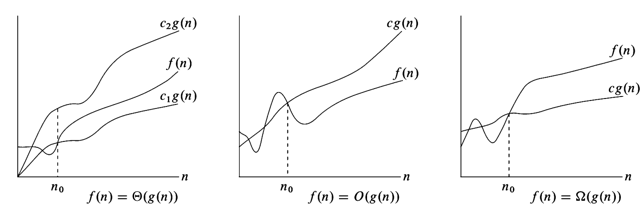

# Лабораторна 1

Мета роботи – вивчити основні методи аналізу обчислювальної складності алгоритмів внутрішнього сортування і оцінити поріг їх ефективності.

Аналіз алгоритму сортування бульбашкою на відповідність властивостям наведено в таблиці:

| Властивість  | Сортування бульбашкою |
| ----------- | ----------- |
| Стійкість||
| «Природність» поведінки (Adaptability)||
| Базуються на порівняннях||
| Необхідність в додатковій пам'яті (об'єм)||
| Необхідність в знаннях про структури даних||

## Псевдокод алгоритму:
```
procedure bubbleSort(A : list of sortable items)
    n := length(A)
    repeat
        swapped := false
        for i := 1 to n-1 inclusive do
            if A[i-1] > A[i] then
                swap(A[i-1], A[i])
                swapped := true
            end if
        end for
    until not swapped
end procedure
```

## Аналіз часової складності


...


## Приклад роботи
...

## Тестування алгоритму
...

## Висновок
...